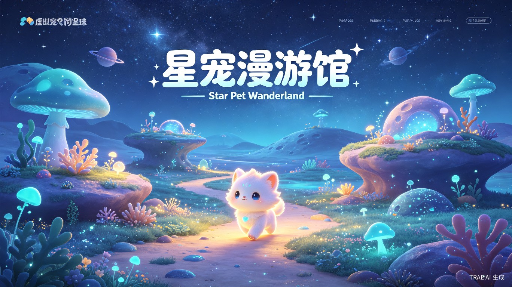

# 星宠漫游馆 · Star Pet Wander Gallery

> 🌌 AI 驱动的自主生命体养成游戏 —— 陪伴者而非照顾者



## 🎮 项目简介

一款基于 **AI Town + Generative Agents** 设计思想的自主生命体养成游戏。玩家作为陪伴者和见证者，观察灵兽在山海灵境世界中自由探索、社交互动、成长进化。

**核心理念：** 灵兽有自己的性格和意志，玩家是陪伴者而非照顾者。即使离线，灵兽也在积累故事。

## ✨ 主要功能

| 功能 | 描述 |
|------|------|
| 🎮 **在线操控** | 点击地图即可移动角色，支持 A* 寻路与碰撞检测 |
| 🤖 **离线AI接管** | 玩家下线后 AI 自动驱动角色继续探索、社交、休息 |
| 📜 **探索记录** | 实时记录灵兽的探索历程，包含发现事件、采集物品等 |
| 💬 **多宠物社交** | 灵兽之间可相互邀请对话，对话内容由 LLM 实时生成 |
| 🔄 **控制切换** | 一键切换玩家控制/AI 控制模式 |
| 🗺️ **山海灵境** | 多个探索区域，每个区域有专属事件 |

## 🎬 演示视频


点击上方视频即可观看星宠漫游馆的游戏演示，展示了灵兽自主探索、玩家操控、探索记录等核心功能。

## 🛠️ 技术栈

- **前端**：React 18 + TypeScript + Vite 5 + Pixi.js + TailwindCSS + Zustand
- **后端**：FastAPI + SQLAlchemy + SQLite + APScheduler
- **AI**：LangGraph + DeepSeek API + Generative Agents 设计思想
- **游戏**：Phaser 3 + A* 寻路算法 + 碰撞检测

## 🚀 快速开始

```bash
# 克隆仓库
git clone https://github.com/Lvi184/Star-Pet-Wander-Gallery.git
cd Star-Pet-Wander-Gallery

# 前端
cd frontend
npm install
npm run dev

# 后端（可选，需要 DeepSeek API Key）
cd backend
pip install -r requirements.txt
python main.py
```

## 📁 项目结构

```
Star-Pet-Wander-Gallery/
├── frontend/          # 前端应用
│   ├── src/
│   │   ├── components/   # UI 组件
│   │   ├── game/         # 游戏引擎
│   │   ├── pages/        # 页面
│   │   └── stores/       # 状态管理
│   └── public/           # 静态资源
├── backend/           # 后端服务
│   ├── ai/               # AI 行为引擎
│   ├── controllers/      # 控制器
│   ├── models/           # 数据模型
│   ├── routers/          # API 路由
│   └── services/         # 业务服务
├── assets/            # 资源文件
└── docs/              # 文档
```

## 🧠 AI 行为决策流程

参考 Stanford Generative Agents 论文：

```
Observation → Memory → Reflection → Planning → Action
```

- **Memory**：SQLite 持久化存储，时间加权检索，短期/长期记忆自动转换
- **Planning**：基于日程和当前状态生成下一步行动
- **Reflection**：定期生成反思摘要，影响后续行为决策

## 💬 对话状态机

```
invited → walkingOver → participating → leave
```

灵兽之间通过完整的对话生命周期进行社交互动，对话内容由 DeepSeek API 生成。

## 📊 项目特色

1. **自主生命体设计**：灵兽有独立性格，不会完全听从玩家
2. **离线自主行为**：玩家离线后 AI 继续驱动角色行动
3. **命运与死亡机制**：包含每日命运等级、受伤、迷路、死亡等风险元素
4. **天道回溯功能**：支持回档后世界线变化，观察不同人生可能性
5. **多宠物社交**：参考 CAMEL 的多智能体协作逻辑

## 📝 开发日志

本项目基于 TRAE AI 创造力大赛开发，使用 TRAE IDE 完成全部开发工作。

**关键开发 Session：**
- `6a5651c60b1e4058d373baed` - 精灵图动画系统实现
- `6a56db930b1e4058d373bf2a` - AI Town 风格对话系统
- `6a57271d0b1e4058d373c3d2` - 探索记录系统开发
- `6a5772bb0b1e4058d373c8fd` - 玩家/AI 控制切换功能

## 📄 许可证

MIT License

## 🤝 贡献

欢迎提交 Issue 和 Pull Request！

---

⭐ 如果这个项目对你有帮助，请给个 Star！